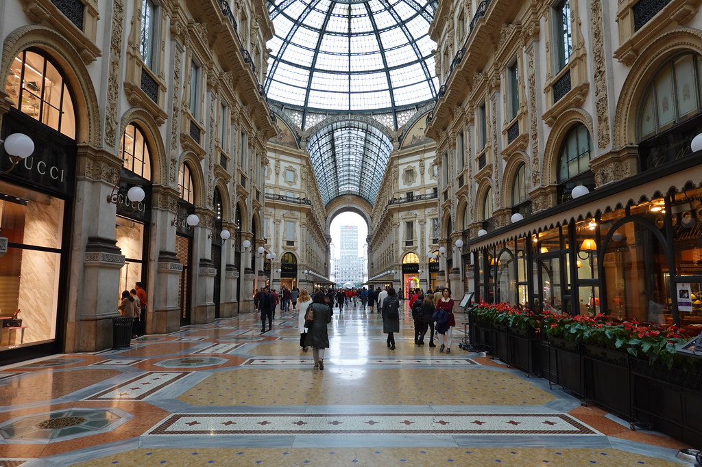
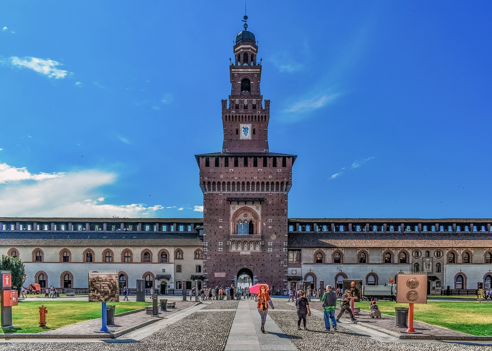
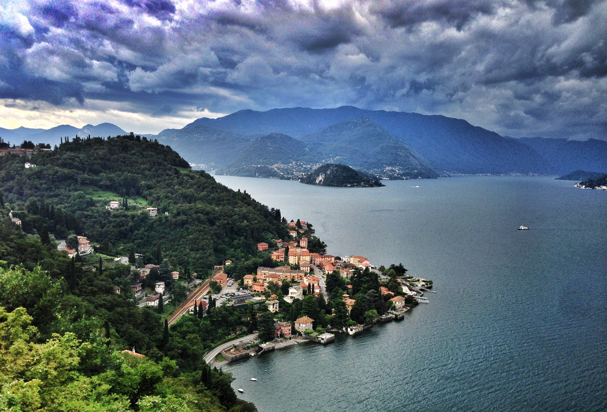
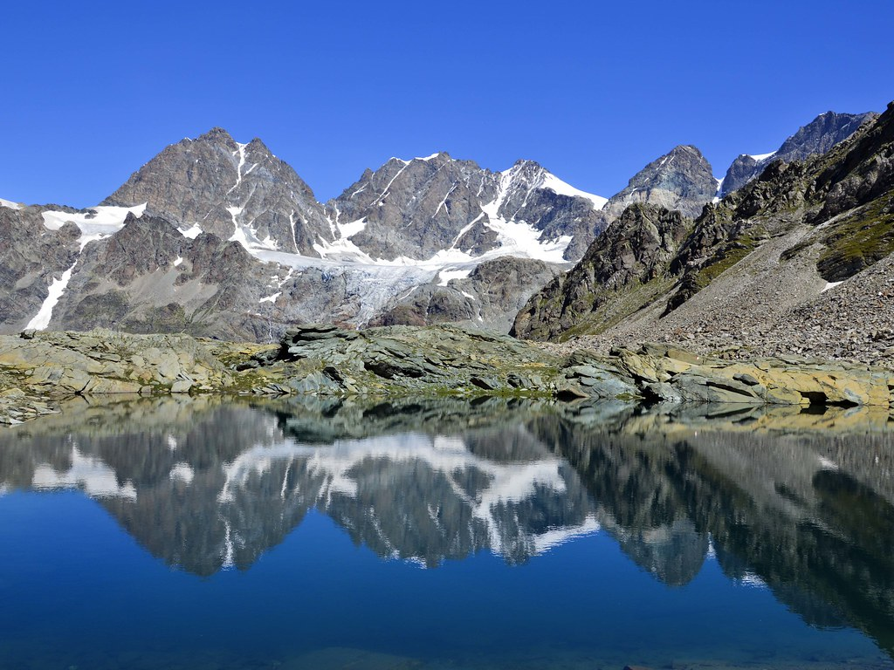

# Tourist Info for Milan and Lombardy

Welcome to Milan, the fashion capital of Italy, and the beautiful region of Lombardy! Here you can find a mix of modern and traditional Italian culture, beautiful architecture, delicious food, and breathtaking nature. 

## Milan 

Milan is known worldwide for its fashion, design, and finance, but it also offers a lot for tourists who are interested in art, history, and culture. Some of the top attractions in the city include: 

- **The Duomo**: Milan's iconic Gothic cathedral that took nearly six centuries to complete. You can climb to the top of the Duomo and enjoy a stunning view of the city. 

- **Galleria Vittorio Emanuele II**: a historic shopping arcade that opened in the late 19th century. It features high-end stores, restaurants, and cafes, and it's a great place to take a break from sightseeing and enjoy a coffee or an aperitivo.

- **The Last Supper**: a famous mural painting by Leonardo da Vinci located in the refectory of the convent of Santa Maria delle Grazie. It's one of the most iconic artworks in the world, and you can book a guided tour to see it up close.

- **Sforza Castle**: a historic fortress that now houses several museums, including the Museum of Ancient Art, the Museum of Musical Instruments, and the Egyptian Museum.

## Lombardy

Lombardy is the largest region in northern Italy and offers a wide range of tourist attractions. Here are some of the best places to visit: 

- **Lake Como**: a picturesque lake surrounded by mountains and charming towns. You can take a boat tour of the lake and visit famous villas and gardens, such as Villa del Balbianello and Villa Carlotta. 

- **Bergamo**: a beautiful medieval city with a stunning old town, called Città Alta, that is surrounded by Venetian walls. You can take a funicular to reach the upper city and enjoy a panoramic view of the surrounding area. 

- **The Alps**: Lombardy is home to some of the most beautiful mountain ranges in Italy, such as the Bernina Range, the Ortler Range, and the Adamello-Presanella Range. You can go skiing, hiking, or

