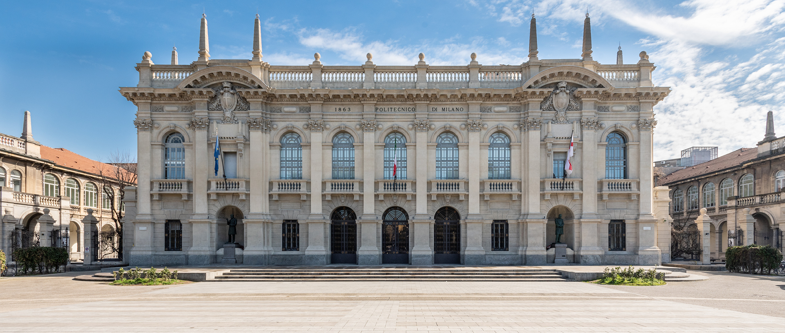

*Politecnico di Milano*

We are honoured and proud to hold the 2023 edition of the 24th International Society for Music Information Retrieval Conference at the premises of the Politecnico di Milano, Leonardo Campus, Milan, Itay.
Politecnico di Milano (PoliMI) is a top-ranked technical University in Europe and Worldwide. In fact, according to the QS World University Rankings by Subject2, PoliMI ranks 20th worldwide (7th in Europe) in Engineering & Technology; 10th worldwide (5th in Europe) in Architecture; and 5th worldwide (3rd in Europe) in Design. Founded in 1863, Polimi is the largest school of Engineering, Architecture and Design in Italy, with 3 campuses in Milan and 5 campuses in the Lombardy region, one of the most industrialized areas of Europe.
PoliMI is organized into 12 departments, responsible for research strategies; and 4 schools, responsible didactic activities, serving over 47 thousand students. PoliMI’s solid internationalization strategy made it the first Italian University to offer all of its master programmes entirely in English, with the result of attracting an ever-increasing number of talented international students coming from over 100 countries. In the academic year 2018- 19, for example, 27% of the students enrolled in PoliMI’s Master of Science Programmes were of international and this percentage is growing by the year. Strategic research is carried out mainly in the fields of energy, transport, planning, management, design, mathematics and natural and applied sciences, ICT, built environment, cultural heritage, with more than 250 laboratories.
It is worth mentioning that, among its many didactic programs, PoliMI offers a M.Sci. program in “Music and Acoustic Engineering”, which takes in 70-80 new students every year, and offers over 150 ECTS credits entirely devoted to all aspects of audio and acoustic engineering (audio and acoustic signal processing, Music Information Retrieval, machine audition, computational acoustics, creative programming and computing, etc.). As for research in the same area, PoliMI has a significant research group of over 30 researchers and academicians, working in 5 labs operating as a network, which have contributed to over 30 EU-funded project, and countless research projects funded by national and international agencies and industrial partners.
